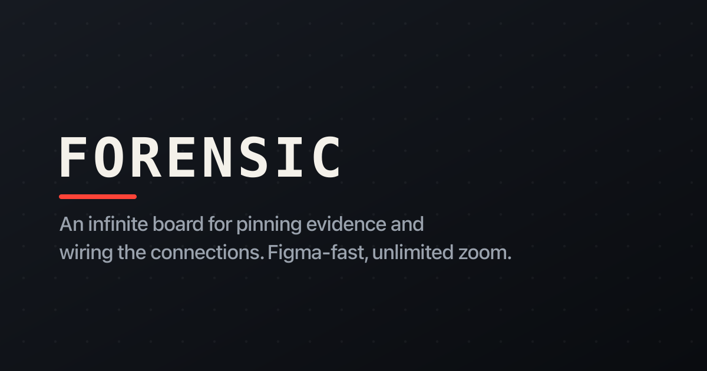

# Forensic

An infinite, Figma-fast board for pinning images and wiring the connections. Drop
unlimited images, zoom without limits, and draw clean 1-to-many links between
anything - like a detective's evidence board that lives in the browser.

**Live:** https://forensic-bheng.vercel.app



## What it does

- **Infinite canvas** - pan and zoom without limits (0.02x to 40x), powered by React Flow.
- **Drop / paste / upload images** - drag image files onto the board, paste from the clipboard, or pick from disk. Large images are downscaled and re-encoded (WebP) so a board packed with photos stays fast.
- **1-to-many connections** - drag from any node edge to wire it to as many others as you like. Connections render as clean red-thread beziers with arrowheads.
- **Case notes** - double-click the canvas to drop an editable typewriter note; tint it, resize it, connect it.
- **Resize & label** - every node resizes (images keep aspect ratio) and takes an inline caption.
- **Boards** - a gallery of saved boards with live vector previews. Autosaves as you work; `Cmd/Ctrl+S` to force.
- **Share** - copy a public read-only link to any board.
- **Light & dark** - the whole canvas + chrome theme together; your choice is remembered.

## Stack

- **Vite + React 19** SPA, **@xyflow/react** (React Flow) for the canvas
- **Express** prod-like server (`serve.mjs`) that mirrors the **Vercel** serverless functions in `api/`
- **Postgres** (`pg`) for board persistence, with a tiny idempotent migration runner
- **Google OAuth** owner sign-in (stateless HMAC session cookie); shared boards stay public to view
- **Vitest** unit tests + **Playwright** e2e against a production build
- Strict CSP (no `unsafe-eval`/`unsafe-inline` for scripts), rate limiting, fail-fast env validation

## Run locally

```bash
npm install
cp .env.example .env      # fill in DATABASE_URL etc. (LOCAL_DEV=true bypasses auth on localhost)
npm run migrate           # create the boards table
npm run dev               # Vite dev server on http://localhost:3036
npm run api               # (separate shell) the API server the dev proxy targets
```

Or run the exact production build locally:

```bash
npm run prod              # vite build + Express server serving dist/ + the API
```

## Test

```bash
npm test                  # vitest unit tests + coverage
npm run test:e2e          # Playwright: API + browser render against a prod build
npm run lint
```

## API

| Method | Route | Auth | Purpose |
|--------|-------|------|---------|
| `GET` | `/api/boards` | owner | list the owner's boards |
| `POST` | `/api/boards` | owner | create a board |
| `GET` | `/api/boards/:id` | public | read a board (for shared links) |
| `PUT` | `/api/boards/:id` | owner | update a board |
| `DELETE` | `/api/boards/:id` | owner | delete a board |
| `POST` | `/api/ai/boards` | Bearer | render-only create for programmatic callers |
| `GET` | `/api/health` | public | liveness + readiness probe |

A board is a React Flow structure: `{ nodes[], edges[] }`. All SQL is parameterized;
image bytes live inline as downscaled data URLs.

## License

MIT - see [LICENSE](LICENSE).
