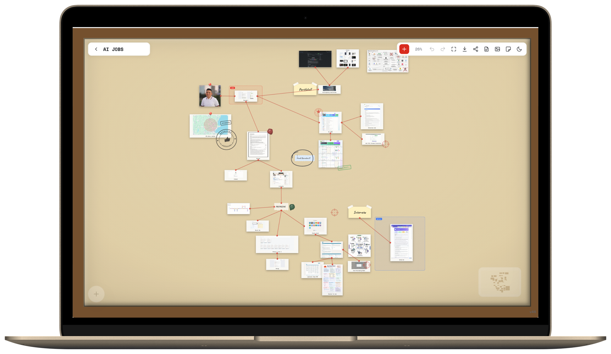

#  Forensic

An infinite, Figma-fast evidence board that lives in the browser.

Pin unlimited images, links, PDFs and notes, zoom without limits, and wire the connections with red threads - like a detective's evidence board, autosaved to Postgres with a local draft for crash safety. 17 evidence types, in-browser OCR, undo history, and a 1-click case report.

**Live:** https://forensic-bheng.vercel.app &middot; [Portfolio](https://bunlongheng.com/projects?name=forensic)



[](LICENSE)


## Features

- **Infinite canvas** - pan and zoom without limits (0.02x to 40x), powered by React Flow.
- **Drop / paste / upload images** - drag image files onto the board, paste from the clipboard, or pick from disk. Large images are downscaled and re-encoded (WebP) so a board packed with photos stays fast.
- **Paste links, PDFs, audio and documents** - paste or drag in a URL, a PDF, an audio or video file or a document and it pins as an exhibit card; click its icon to open the real thing in a new tab. Files ride inside the board (max 2 MB each - pin a link to anything heavier).
- **Red threads** - drag from any node edge to wire it to as many others as you like. Threads attach to the nearest point on each card's boundary and light up when either end is selected.
- **Auto-thread** - multi-select assets and hit **Chain** (nearest-neighbour path) or **Fan** (biggest asset out to the rest).
- **Group / ungroup** - wrap a selection in a container so the whole set moves as one (`Cmd/Ctrl+G`, `Shift` to ungroup).
- **17 evidence types** - see the table below. Every node except the auto-height quick note resizes; most take a tint, photos take a caption, and the annotation ring supports lock and send-to-back.
- **In-browser OCR** - the case report runs tesseract.js over every pinned photo, self-hosted, zero API cost.
- **Case report** - one click renders the board as a readable report (images, notes, threads).
- **Undo / redo** - 100 steps of durable history, `Cmd/Ctrl+Z` and `Cmd/Ctrl+Shift+Z`.
- **Autosave + crash safety** - debounced saves to Postgres, a fast local draft on this device, and a retry the moment the connection returns.
- **Boards** - a gallery of saved boards with live vector previews and a trash with restore.
- **Share** - copy a public read-only link to any board. Phones and touch devices always open read-only.
- **Light & dark** - the whole canvas + chrome theme together; your choice is remembered.

### Evidence types

| Type | What it is | Type | What it is |
|------|------------|------|------------|
| `image` | Pinned photo, torn edge, optional wrinkle + OCR | `note` | Sticky note with tint (legacy/API-created type - no menu tool) |
| `text` | Handwritten text block (Caveat) | `clip` | Paper-clipped quick note (auto height) |
| `callout` | Speech-bubble emphasis | `stamp` | Slanted or circle ink stamp (APPROVED, SECRET, ...) |
| `redaction` | Black bar | `marker` | Numbered crime-scene marker |
| `wax` | Wax seal | `crosshair` | Target crosshair |
| `spotlight` | Dims everything outside a circle | `annotation` | Hand-drawn ring |
| `drawing` | Freehand ink, in the add menu | `sticker` | Emoji sticker |
| `profile` | Person card (name + color) | `container` | Titled section that groups children |
| `file` | Link / PDF / audio / video / doc exhibit, opens in a new tab | | |

### Keyboard shortcuts

| Keys | Action |
|------|--------|
| Double-click canvas | Drop a quick note, already open for typing |
| `Cmd/Ctrl+S` | Save now |
| `Cmd/Ctrl+Z` / `Cmd/Ctrl+Shift+Z` | Undo / redo |
| `Cmd/Ctrl+C` | Copy the selection - a group brings its children and the wiring between the copied nodes |
| `Cmd/Ctrl+X` | Cut the selection, removing it and any threads attached to it |
| `Cmd/Ctrl+V` | Paste at the cursor, **on any board** - the clipboard survives switching boards (a file, SVG markup or a URL on the system clipboard always wins) |
| `Cmd/Ctrl+G` / `Cmd/Ctrl+Shift+G` | Group / ungroup the selection |
| `Shift` + drag | Snap a node into a straight line with the nodes it is wired to |
| `Backspace` / `Delete` | Remove the selection |

### Images

Image bytes live in their own `board_images` rows, not inside the board JSON. A
node stores `/api/images/<id>` - about 30 bytes - so a board is text again and
holds as many photos as you like. Each upload is its own request, which is what
keeps a 50-photo board from ever building a body big enough for the platform to
reject (Vercel caps a function request at 4.5 MB). Images are served with a
one-year immutable cache, so reopening a board costs nothing.

Boards saved before this still render untouched: a node's `src` is just a string,
and an inline `data:` URL and a `/api/images/<id>` URL both work. To lift the old
inline bytes out, run the migration - it backs up each board first and is
reversible:

```bash
node scripts/extract-board-images.mjs           # dry run, prints what it would move
node scripts/extract-board-images.mjs --write    # do it; originals go to backups/
node scripts/extract-board-images.mjs --restore backups/board-<id>.json
```

## Architecture

[](https://flows-bheng.vercel.app/?id=a290832d-fe84-41d5-abf4-e116ed6fc170)

Interactive version: [Flows](https://flows-bheng.vercel.app/?id=a290832d-fe84-41d5-abf4-e116ed6fc170). How a pinned photo becomes a saved board: [sequence diagram](https://sequences-bheng.vercel.app/d/759ab379-ba1f-4378-b1ec-08f74322a00a).

- **`src/views/Board.jsx`** owns the canvas: React Flow wiring, selection, drag/drop/paste, the inspector.
- **`src/lib/boardGraph.js`** is the pure core - sanitize, group/ungroup, chain/fan threading, snap, z-order, edge styling. No React, fully unit-tested.
- **`src/hooks/`** hold the stateful concerns: `useBoardPersistence` (server autosave, local draft, online retry, `Cmd+S`, restore-on-open) and `useUndoRedo` (snapshot history + keys).
- **`src/components/`** are the node types plus the chrome (top bar, add menu, inspector, report modal).
- **`lib/handlers/`** are the API handlers. `api/*.js` (Vercel) and `serve.mjs` (local / CI) both import them, so there is one source of truth.
- The Board chunk is lazy-loaded: sign-in and the gallery never download React Flow or the node types.

### Persistence model

A board is `{ title, nodes[], edges[] }` in React Flow shape. Every change is reduced to a
**durable snapshot** (selection, drag and hover state stripped) and that string drives everything:

| Path | When | Where |
|------|------|-------|
| Local draft | 350 ms after any change | IndexedDB on this device |
| Server save | 1100 ms after any change, or `Cmd+S` | `PUT /api/boards/:id` |
| Online retry | The `online` event | Pushes the unconfirmed snapshot |
| Restore on open | Once per open | Draft newer than the server copy wins, then autosave pushes it |
| Undo history | Every snapshot | In memory, 100 entries |

### How a photo travels

[](https://sequences-bheng.vercel.app/d/759ab379-ba1f-4378-b1ec-08f74322a00a)


## Tech stack

- **Vite + React 19** SPA, **@xyflow/react** (React Flow) for the canvas
- **Express** prod-like server (`serve.mjs`) that mirrors the **Vercel** serverless functions in `api/`
- **Postgres** (`pg`) for board persistence, with a tiny idempotent migration runner
- **Google OAuth** owner sign-in (stateless HMAC session cookie); shared boards stay public to view
- **tesseract.js** for OCR, vendored under `public/tesseract` so the CSP needs no external host
- **Vitest** unit tests with a coverage ratchet + **Playwright** e2e against a production build
- Strict CSP (no `unsafe-eval`/`unsafe-inline` for scripts), HSTS, Permissions-Policy, rate limiting, fail-fast env validation

## Quick start

```bash
git clone https://github.com/bunlongheng/forensic.git
cd forensic
npm install
cp .env.example .env      # fill in DATABASE_URL etc. (LOCAL_DEV=true bypasses auth on localhost)
npm run migrate           # create the boards table
npm run dev               # Vite dev server on http://localhost:3036
npm run api               # (separate shell) the API server the dev proxy targets
```

Or run the exact production build locally:

```bash
npm run prod              # vite build + Express server serving dist/ + the API
```

## Configuration

| Variable | Required | Purpose |
|----------|----------|---------|
| `DATABASE_URL` | yes | Postgres connection string |
| `DATABASE_SSL` | no | `"true"` for a remote Postgres |
| `DATABASE_CA` | no | PEM CA certificate; when set, Postgres TLS is verified instead of skipped |
| `FORENSIC_API_SECRET` | yes | Bearer token for `POST /api/ai/boards` (the only Bearer-auth route) |
| `OWNER_USER_ID` | yes | `boards.user_id` for API-created boards |
| `GOOGLE_CLIENT_ID` / `GOOGLE_CLIENT_SECRET` | yes | Google OAuth web client |
| `AUTH_SECRET` | yes | Session-cookie signing secret |
| `OWNER_EMAIL` | yes | The only Google account allowed to sign in |
| `SESSION_MIN_IAT` | no | Unix seconds; sessions issued before this are rejected (rotate after a suspected leak) |
| `LOCAL_DEV` | no | Dev-only auth bypass on localhost / LAN. Never set in prod |
| `PORT` | no | Server port, default `4336` |

`lib/env.js` fails the build and the server fast when a required variable is missing - imported by both the Vite build and the server (`serve.mjs`). See `.env.example`.

## Testing

```bash
npm test                  # vitest unit tests + coverage (thresholds ratchet upward only)
npm run test:e2e          # Playwright: API + browser render against a prod build
npm run lint
```

CI (`.github/workflows/ci.yml`) runs lint, unit tests, migrations, and the e2e suite against
a throwaway Postgres on every push and pull request. `prod-monitor.yml` probes the live
health endpoint on a schedule.

## License

MIT - see [LICENSE](LICENSE).

---

<div align="center">

<a href="https://bunlongheng.com"></a>
<a href="https://www.linkedin.com/in/bunlongheng/"></a>
<a href="https://www.instagram.com/ibunlong/"></a>
<a href="mailto:bheng.code@gmail.com"></a>

<br>

Built by **[Bunlong](https://bunlongheng.com)** &nbsp;&middot;&nbsp; [more apps](https://bunlongheng.com/projects)

</div>
